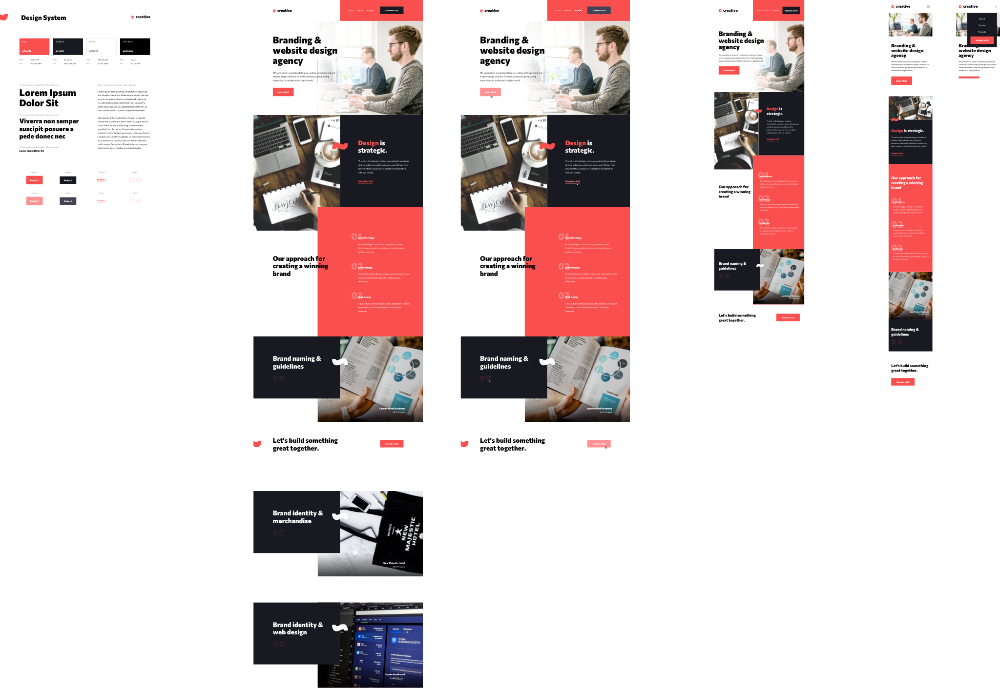

# THE DESIGN

In this download, I provide both Sketch and Figma versions of the design. So you can see how accurate the code is.

# DEVELOPMENT

This project is built with HTML, SASS, and JAVASCRIPT (VANILLA).

It is built with a gulp, a tools that allows me to run the tasks repetitive during the development.

Here I use it to :

        Spin up a web server (for development, not revelant when deployed in Netlify)

        Reload the browser automatically whenever a file is saved

        Use preprocessors like Sass or LESS

        Optimize assets like CSS, JavaScript, and images (by mimifying the size of the files).

You can see the final result :
